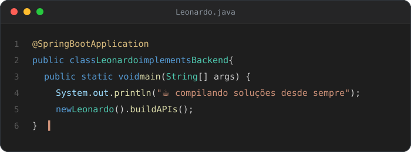

# 👋 Olá!

Sou **Leonardo Lemos**, desenvolvedor Backend apaixonado por criar soluções escaláveis.

Atualmente estou cursando **Software Engineering** na Jala University.

Também possuo experiência prática no desenvolvimento de:

- Sistemas Web e Desktop
- Plugins para WordPress
- WooCommerce
- APIs REST
- Automações
- Integrações entre sistemas
- Construção de Banco de Dados

Meu objetivo é construir softwares robustos, performáticos e de fácil manutenção.

 

# 🚀 Atualmente

- 🎓 Engenharia de Software
- ☕ Estudando Java e Spring Boot
- ⚙️ Desenvolvendo APIs REST
- 💼 Gerenciando minha EUpresa
- 🔌 Criando automações e integrações
- 🛒 Desenvolvimento de soluções para e-commerce
 

## 🛠️ Stack Tecnológica

<b>Backend</b>

<b>Frontend</b>

<b>Banco de Dados</b>

<b>DevOps &amp; Ferramentas</b>

 

## 📈 Atividade em tempo real

 

## 📊 Estatísticas

 

